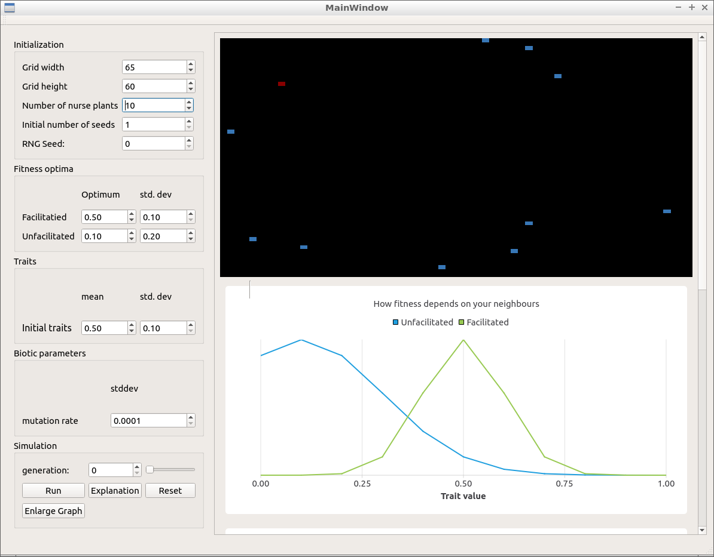

# Korte project

Branch||
---|---|---
`master`| | 
`develop`| | 

Spatial model for Megan Korte, used until the superior [Korter project](https://github.com/richelbilderbeek/korter_project).

The Korte project is developed by

 * Jeroen Niemendal
 * Florian de Jager
 * Richel Bilderbeek

